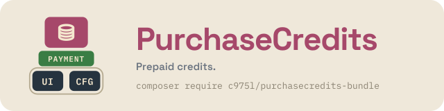

# PurchaseCreditsBundle

Symfony bundle for prepaid credits on the c975L core — credit packs sold through the basket, a per-user ledger and a spending API the site's own services call. Checkout is delegated to [c975L/PaymentBundle](https://github.com/975L/PaymentBundle).

[](https://github.com/975L/PurchaseCreditsBundle/blob/main/LICENSE)
[](https://packagist.org/packages/c975l/purchasecredits-bundle)
[](https://packagist.org/packages/c975l/purchasecredits-bundle)
[](https://app.codacy.com/gh/975L/PurchaseCreditsBundle/dashboard)

**[Bundle page](https://bundles.975l.com/en/pages/purchasecredits-bundle) · [Tutorials](https://bundles.975l.com/en/tutoriels/purchasecredits-bundle) · [Block kinds](https://bundles.975l.com/en/pages/blocks/PurchaseCredits) · [Live demo](https://bundles.975l.com/demo/) · [Demo back-office](https://bundles.975l.com/demo/login)**

> **BUNDLE UNDER DEVELOPMENT — USE AT YOUR OWN RISK**

---

## Why PurchaseCreditsBundle



Add PurchaseCreditsBundle on top of the shared [CoreBundle](https://github.com/975L/CoreBundle) foundation to sell credits and let the site spend them. The purchase flows through [PaymentBundle](https://github.com/975L/PaymentBundle)'s Basket/checkout engine (`BasketItemProviderInterface`) instead of duplicating one; what a credit buys is the site's own business, decided by its own services.

---

> **TL;DR** — Credit packs sold through PaymentBundle's basket, a ledger per user whose sum is the balance, and `CreditServiceInterface::spend()` for the site's services. No route, one config key (its test mode), no email of its own.

## Contents

- **Setup** — [requirements](#requirements) · [installation](#installation)
- **Using it** — [selling credits](#selling-credits) · [spending credits](#spending-credits) · [twig](#twig) · [translations](#translations) · [what it does not contribute](#what-this-bundle-deliberately-does-not-contribute) · [AI agent skills](#ai-agent-skills) · [upgrading from v4](#upgrading-from-v4)

## Features

- Credit packs — a number of credits at a price and a VAT rate — managed in the back office and sold through PaymentBundle's basket
- A ledger per user: every movement (purchase, gift, spending) is a line, and the balance is their sum — never a counter stored beside them
- A spending API, `CreditServiceInterface`, that locks the account while it reads the balance and writes, so two spendings at once cannot both pass on the same credits
- A payment delivered twice credited once: a purchase line answers to the basket number and the pack
- The `purchasecredits_packs` block, placed on any composed page, with the reader's balance and a "Buy" button per pack
- Two back-office screens contributed to the EasyAdmin dashboard (`MenuProviderInterface`): the packs, and the ledger, which only ever adds lines
- Two guided projects (`GuidedProjectProviderInterface`): putting a pack on sale, and giving or taking credits by hand
- Its own `purchasecredits` translation catalogue, in English, French and Spanish
- A test mode, `purchasecredits-test-mode`, switched from a dashboard tile (`ShortcutProviderInterface`): a banner above the packs says nothing is really sold
- A demo dataset (UiBundle's `DemoFixtureProviderInterface`): three packs on sale, and no ledger — its lines name accounts, which are the site's own
- **A skill for coding agents**, shipped in the package and read straight from `vendor/` — see [AI agent skills](#ai-agent-skills)

---

## Requirements

- PHP >= 8.4, Symfony 8
- [c975L/CoreBundle](https://github.com/975L/CoreBundle) — ConfigBundle and UiBundle in one package: user accounts, the dashboard, the blocks
- [c975L/PaymentBundle](https://github.com/975L/PaymentBundle) — owns the Basket/checkout engine, installed and configured (payment provider keys, `shop-currency`)

---

## Installation

### Download

```bash
composer require c975l/purchasecredits-bundle
```

### Run migrations

```bash
php bin/console doctrine:migrations:diff
php bin/console doctrine:migrations:migrate
```

Two tables: `credit_pack` and `credit_transaction`, whose lines go with the account they belong to (`ON DELETE CASCADE`).

### Nothing to register by hand

No route to import, no asset to install - and one config key, loaded with the others by `php bin/console c975l:config:load-all`: the menu entries, the block kind, the basket provider and the Twig functions are picked up by autoconfiguration. The block's "Buy" button is PaymentBundle's own `basket` Stimulus controller, registered by that bundle.

---

## Selling credits

1. In the back office, **Credits > Credit packs**: create the packs (credits, price in the shop's currency, VAT).
2. Place the **Credit packs** block on a page. A signed-in visitor sees their balance and a "Buy" button per pack; a visitor is asked to sign in, credits landing on an account.
3. Once the basket is paid, `CreditBasketItemProvider::onBasketPaid()` writes one ledger line per pack, with the number of credits frozen in the basket when it was filled — what the customer agreed to is what is credited, whatever the pack becomes before the payment.

A pack withdrawn from sale is refused at the checkout too, a basket living several days in the session. A basket filled before signing in is bound to the account signed in at the checkout.

---

## Spending credits

```php
use c975L\PurchaseCreditsBundle\Exception\InsufficientCreditsException;
use c975L\PurchaseCreditsBundle\Service\CreditServiceInterface;

public function __construct(private readonly CreditServiceInterface $creditService) {}

// What is left
$balance = $this->creditService->getBalance($user);

// Takes credits, or writes nothing at all
try {
    $this->creditService->spend($user, 5, 'Short link /abc', (string) $shortcut->getId());
} catch (InsufficientCreditsException $exception) {
    // $exception->balance, $exception->amount
}

// Gives credits: a sign-up bonus from the site's own registration code, a gift
$this->creditService->grant($user, 3, 'Welcome credits', 'signup');
```

`spend()` locks the user's row while it reads the balance and writes the line, so two spendings at once cannot both pass on the same credits. Never read `getBalance()` and then write a line yourself. `InsufficientCreditsException` is thrown once the transaction is over, so the EntityManager stays open and the caller carries on.

The ledger is the only truth: never store a balance beside it. A line is never edited nor deleted — **Credits > Credit movements** only adds lines, a mistake being corrected by the reversing line.

---

## Twig

| Function | Returns |
| --- | --- |
| `purchasecredits_packs()` | the published packs, in the back office order |
| `purchasecredits_balance()` | the signed-in user's balance, `null` for a visitor |

The block is never cached: the balance shown next to the packs belongs to whoever reads the page. Override `templates/bundles/c975LPurchaseCreditsBundle/blocks/Packs.html.twig` in the app to change its markup.

---

## Translations

The bundle ships `translations/purchasecredits.{en,fr,es}.xlf` and resolves every label in its own **`purchasecredits`** domain — the spoken narrations of its guided projects in **`purchasecredits_narration`** — including the anchor and background fields UiBundle's traits add to the block's form. The one word it borrows — the "added!" confirmation of the basket — is PaymentBundle's.

A pack carries no free text to translate: its title, "%count% credits", comes from the catalogue, in the reader's language. A ledger line's description is written in the language of the basket it answers to.

---

## What this bundle deliberately does not contribute

ConfigBundle and UiBundle expose a long list of contribution points, and not branching one is a valid answer — it is only worth writing down:

| Point | Why not |
| --- | --- |
| Emails | the purchase is confirmed by PaymentBundle's own order email, like any basket |
| Sign-up bonus | registration is the application's own code (scaffolded), which calls `grant()` |
| Content translation | a pack has no free text: its title is "%count% credits", from the translation catalogue |
| "What's new", procedures | to be written once the bundle runs on a site |
| Stylesheet, scripts | the block is drawn with UiBundle's section and card classes, and its button is PaymentBundle's `basket` controller |
| Sitemap, linkable routes | no public page of its own: the packs are a block placed on the site's pages |
| Health check, status `extra` | nothing here calls for an action a maintainer takes |
| Import / export | a ledger is not a catalogue |

---

## AI agent skills

The package ships a skill of its own, `skills/c975l-purchasecredits/SKILL.md`, written for the coding agent of the site installing this bundle rather than for someone modifying it. Point your agent at it:

```text
vendor/c975l/purchasecredits-bundle/skills/
```

It holds what an agent gets wrong when left to its own habits — a `credits` column added on the user, a balance read and then written in two steps, a ledger line edited — alongside the services, entities and Twig functions, each named as it actually is in the sources.

Nothing is installed, nothing is copied into your project: the file sits in `vendor/` like any other part of the package and follows it at each `composer update`. A user of Claude Code wanting it to load by itself symlinks it into their own skills directory:

```bash
ln -s ../../vendor/c975l/purchasecredits-bundle/skills/c975l-purchasecredits .claude/skills/c975l-purchasecredits
```

`Tests\SkillsTest` keeps the file honest: every path, class member, Twig function and block kind it quotes is checked against the sources, so renaming any of them fails the build rather than leaving an agent confidently wrong.

---

## Upgrading from v4

v5 is a rewrite on the c975L core; nothing of v4's API survives. v4 (Symfony 4, legacy architecture) lives on the [`4.x`](https://github.com/975L/PurchaseCreditsBundle/tree/4.x) branch, and [UPGRADE.md](UPGRADE.md) gives the mapping and the SQL that takes over a v4 ledger.

---

## License

MIT — see [LICENSE](LICENSE).
